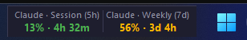

# ai-usagebar-widget




Widget flutuante pro Windows: uma janelinha sem borda, sempre no topo,
com cantos transparentes — você arrasta pra qualquer canto da tela e
solta. Mostra o uso da conta **Claude** (janela de 5h e semanal) e o
saldo de outras APIs (ex.: DeepSeek), puxando os dados do
[ai-usagebar](https://github.com/akitaonrails/ai-usagebar) (Rust, MIT)
via `ai-usagebar usage --json`.

Não é um fork nem contém código do `ai-usagebar` — é só um consumidor do
binário dele via `subprocess`. Todo o crédito pelo motor de coleta de
dados é do projeto original; este repo é só a "casca visual" em cima.

O motor é genérico: qualquer provedor que o `ai-usagebar` souber consultar
(Claude/Anthropic, OpenAI/Codex, Z.AI, OpenRouter, DeepSeek, Kimi,
Moonshot, Grok/xAI, Google Antigravity, Cursor, MiniMax, Kiro, ...) vira
um bloco automaticamente assim que você configurar no `ai-usagebar` — não
precisa mexer no código do widget.

## O que o widget faz

- **Blocos lado a lado**, um por métrica configurada — % de uso + tempo
  até resetar (Claude), ou um saldo em texto (DeepSeek). Cada bloco só
  ocupa a largura que o próprio texto precisa.
- **Destacar/reagrupar blocos**: clique direito EM CIMA de um bloco
  específico mostra "Destacar" — ele vira sua própria janelinha
  independente, arrastável pra qualquer canto da tela (útil se você tem
  muitos provedores e quer espalhar em vez de manter tudo grudado). O
  menu da janela destacada tem "Reagrupar" pra voltar.
- **Ocultar/reexibir blocos**: o mesmo clique também mostra "Ocultar" —
  o bloco some por completo (não vira janela, só desaparece), útil pra um
  provedor que você não está usando agora. Reaparece pelo submenu
  "Reexibir bloco oculto" na janela principal. Pelo menos um bloco sempre
  fica visível — não dá pra ocultar todos de uma vez, pra nunca ficar sem
  onde clicar pra reverter.
- **Dados desatualizados são sinalizados**: se o `ai-usagebar` parar de
  responder, o widget mantém os últimos números bons na tela (em vez de
  piscar pra vazio numa falha transitória) mas esmaece a cor e mostra um
  🕐 discreto no canto — pra você nunca confiar num número velho achando
  que é atual.
- **Log em arquivo**: `%LOCALAPPDATA%\ai-usagebar-widget\widget.log`
  (rotativo). Item "Abrir log" no menu de contexto. Sob `pythonw.exe`
  (o jeito normal de rodar) não existe console nenhum, então isso é o
  único jeito de diagnosticar algo que deu errado.

## Pré-requisitos (no Windows, o host)

1. **Python 3** com Tkinter — o instalador oficial do
   [python.org](https://www.python.org/downloads/) já inclui, não precisa
   de nenhuma lib externa (só biblioteca padrão).
2. **`ai-usagebar` instalado e configurado**, com `ai-usagebar usage --json`
   funcionando no PowerShell — isso inclui ter rodado `claude` uma vez
   (autenticação OAuth do Claude Pro) e, se for usar outros provedores,
   configurar as chaves deles em `config.toml` (`enabled = true` pra
   vendors opt-in, como o DeepSeek).

## Adicionar um provedor

O widget não tem nenhum provedor fixo no código — ele mostra
automaticamente qualquer métrica que o `ai-usagebar` retornar. Pra
adicionar um novo:

1. Confira se o `ai-usagebar` já suporta ele (a lista já cobre
   Claude/Anthropic, OpenAI/Codex, Z.AI, OpenRouter, DeepSeek, Kimi,
   Moonshot, Grok/xAI, Google Antigravity, Cursor, MiniMax, Kiro e outros).
2. Configure a chave dele em `config.toml` (`enabled = true` pros que são
   opt-in, como o DeepSeek).
3. Pronto — na próxima atualização o bloco aparece sozinho, sem precisar
   mexer em nada neste repositório.

Se o `ai-usagebar` ainda não suporta o provedor que você quer, o pedido é
lá no [projeto original](https://github.com/akitaonrails/ai-usagebar) —
este widget só consome o que ele já expõe.

## Como rodar

```powershell
python widget.py                # modo normal, consulta o ai-usagebar de verdade
python widget.py --mock         # dados falsos, pra testar a interface sem
                                 #   precisar do ai-usagebar instalado/rodando
```

- **Arrastar**: clique e segure com o botão esquerdo em qualquer janela
  (principal ou destacada) e mova. Ao soltar, a posição é salva em
  `layout.json` (nessa mesma pasta) e restaurada da próxima vez.
- **Menu de contexto** (botão direito, solta pra confirmar com o
  esquerdo): Atualizar agora, Abrir log, Destacar/Ocultar/Reagrupar bloco
  (clicando em cima de um bloco específico), Reexibir bloco oculto (se
  houver), Ver erro (se houver), Sair.
- Atualiza sozinho a cada 60 segundos.

Pra rodar junto com o Windows sem abrir o PowerShell na mão, rode
`create_shortcut.ps1` (cria um atalho na área de trabalho apontando pro
`pythonw.exe`, sem janela de console):

```powershell
powershell -ExecutionPolicy Bypass -File create_shortcut.ps1
```

E copie o atalho gerado pra pasta de Inicialização (`Win+R` → `shell:startup`)
se quiser que abra sozinho no login.

## Limitação de plataforma

Este widget **só funciona de verdade no Windows**. A transparência de
cantos e o reforço de "sempre no topo" dependem de recursos específicos do
Windows. Em Linux/macOS a janela ainda abre e funciona (útil pra testar
com `--mock`), só sem essas coisas — não é o alvo do projeto, é só pra não
quebrar caso alguém rode em outro SO.

## Créditos e licença

Motor de coleta de dados: [ai-usagebar](https://github.com/akitaonrails/ai-usagebar)
(Rust, MIT), de akitaonrails — este projeto só o invoca via `subprocess`,
sem nenhuma linha do código dele.

Este repositório está sob licença MIT — veja [LICENSE](LICENSE).
